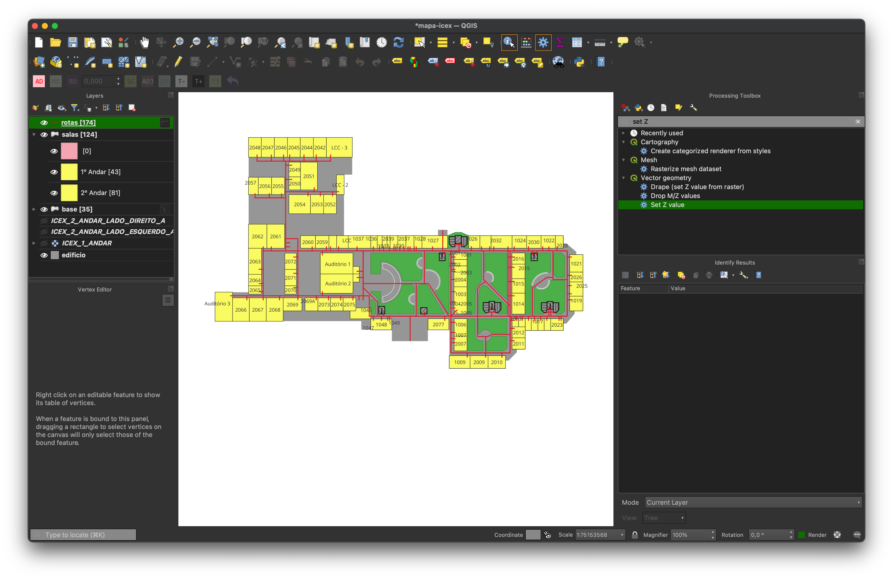
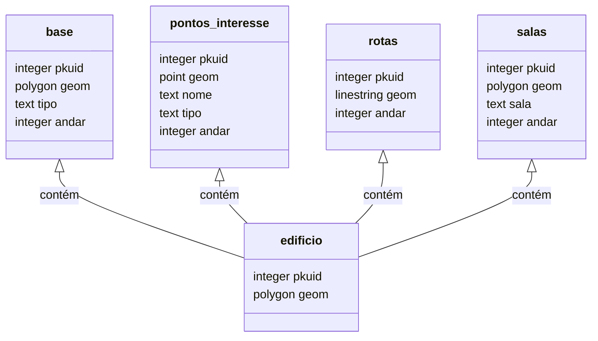

# Tema: Mapa Interativo de Salas do ICEx

Ariel Augusto dos Santos

Este relatório descreve o trabalho prático realizado na disciplina Banco de Dados Geográficos 2022/2, ministrada pelo professor Clodoveu Davis.

[[toc]]

* * *

## Introdução

O trabalho desenvolvido consistiu na criação um mapa interativo de salas do Instituto de Ciências Exatas da UFMG, com a finalidade de facilitar a localização de salas e a visualização de informações sobre as turmas que tem aula nestas. Para isto, foi necessário a digitalização da planta do ICEx, o georeferenciamento das salas, a extração de dados com a relação completa das salas e turmas, e por último o desenvolvimento de um website para a visualização do mapa interativo.

## Desenvolvimento

### Pesquisa e planejamento

A etapa mais complexa e demorada do trabalho foi a pesquisa e planejamento. Para isto, foi necessário a leitura de diversos artigos, tutoriais e apresentações sobre o uso do QGIS, bibliotecas web para visualização de mapas e manipulação de dados geográficos, e o desenvolvimento de mapas para ambientes internos e edifícios. Após a leitura destes artigos, foi possível a escolha das plataformas e bibliotecas de software, e uma especificação maior do escopo do trabalho.

#### Referências notáveis

[UFPR CampusMap](https://campusmap.ufpr.br):
:	Iniciativa da UFPR com o propósito de apresentar informações geográficas da estrutura externa dos campi e do interior dos prédios da instituição. Uma das funcionalidades permite que o usuário trace rotas entre dois pontos, seja em entre ambientes internos e/ou externos.

[9 - Mapping Indoor Environments: Challenges Related to the Cartographic Representation and Routes](https://doi.org/10.1016/B978-0-12-813189-3.00009-5):
:	Artigo produzido pelo projeto UFPR CampusMap detalhando a adaptação do PostGIS e PgRouting para cálculo de rotas em 3 dimensões e entre ambientes.

[QGIS UK - Indoor routing with QGIS and pgRouting - Tim Manners, OS](https://www.youtube.com/watch?v=H-v9SXwc3BQ):
: 	Apresentação sobre o uso do QGIS e pgRouting para a criação de rotas 3D em ambientes internos.^[Slides disponíveis em https://www.slideshare.net/RossMcDonald1/creating-and-indoor-routable-network-with-qgis-and-pgrouting]

#### Especificação do escopo e escolha de ferramentas

Foi definido que um dos objetivos do trabalho seria disponibilizar o site hospedado no próprio ICEx, e portanto o site deveria ser estático - significando que todo o código de geração das visualizações tem de executar no dispositivo do cliente. Isso foi facilitado pelo pequeno volume de dados, que não exige um servidor para a geração das visualizações - podendo ser processado de maneira relativamente ineficiente no navegador utilizando apenas Javascript.

Foi decidido que o projeto seria desenvolvido utilizando o [QGIS](https://www.qgis.org/en/site/) (com o plugin [Freehand raster georeferencer](http://gvellut.github.io/FreehandRasterGeoreferencer/)) para a digitalização da planta do ICEx, o [SpatiaLite](https://www.gaia-gis.it/fossil/libspatialite) e [GeoJSON](https://geojson.org) para armazenamento dos dados geográficos. Para a visualização do mapa, foi decidido utilizar o [Leaflet](https://leafletjs.com), uma biblioteca web para a criação de mapas interativos; [Turf.js](http://turfjs.org) para a manipulação dos dados e [GeoJSON Path Finder](https://github.com/perliedman/geojson-path-finder) para o cálculo das rotas. Para a criação do website, foi usado o [Vite](https://vitejs.dev), um gerador de sites estáticos.

Por limitação de tempo e das bibliotecas utilizadas, foi decidido que as rotas seriam calculadas apenas entre salas do mesmo andar. Apesar disso, os dados geográficos  foram armazenados incluindo uma coordenada _Z_, permitindo que futuramente o cálculo de rotas entre andares seja implementado.

### Digitalização da planta do ICEx

A primeira etapa do trabalho consistiu na digitalização da planta do ICEx, que foi feita utlizando o software QGIS. Para isto, foi necessário a criação de um novo projeto no QGIS, e a importação de esquemas do ICEx disponíveis na internet em formato PNG[^1]. Como o mundo do mapa é totalmente interno (e assim suas coordenadas não correspondem ao mundo real), a escolha do sistema de coordenadas foi arbitrária já que qualquer projeção planar bastaria. Primeiramente foi digitalizado o contorno do prédio, depois os pátios, escadas e outros objetos para a base do mapa, e então as salas e por último as redes de locomoção e pontos de interesse/referência.

#### Esquema de Dados

### Criação do website

O website desenvolvido consiste de dois componentes principais: um formulário para a seleção de origem e destino, e um mapa interativo para a visualização das rotas. O formulário permite que o usuário pesquise por turmas de todas disciplinas ofertadas no ICEx, e após selecioná-la é possível escolher um ponto de referência para a origem da rota (como por exemplo a portaria principal). O mapa é gerado utilizando o Leaflet, e as rotas são calculadas utilizando o GeoJSON Path Finder. O Turf.js foi usado para a manipulação dos dados, como por exemplo a filtragem de polígonos por andar e cálculo de _bounding boxes_ para mover a janela do mapa.

### Implantação do website

Após compilação, o website é gerado na pasta `dist`, que pode ser hospedada em qualquer servidor web estático. Para a implantação do website no ICEx, foi utilizado minha área pessoal no servidor do DCC^[https://www.crc.dcc.ufmg.br/servicos/website/start] (https://homepages.dcc.ufmg.br/~ariel.santos/).

## Conclusão

Pode se considerar que o projeto atingiu todos seus objetivos iniciais, e que o website desenvolvido é uma ferramenta útil para membros do ICEx. O trabalho foi desenvolvido em um período de aproximadamente 2 semanas, e funcionalidades que não foram implementadas, mas que podem ser adicionadas no futuro são: cálculo de rotas entre andares, e cálculo de rotas para pessoas com mobilidade reduzida além de melhorias de usabilidade. O projeto foi uma experiência positiva e interessante, e possibilitou um aprendizado prático sobre os desafios de projetos de bancos de dados geográficos, em especial digitalização de mapas e integração com sistemas web.

O website está disponível em https://homepages.dcc.ufmg.br/~ariel.santos/mapa-icex/. O website foi desenvolvido utilizando ferramentas de código aberto, e portanto pode ser facilmente replicado em outros ambientes. O código do website e projeto do QGIS pode ser encontrado no [repositório do projeto no GitHub](https://github.com/ariel-codes/mapa-salas-icex).

[^1]: Disponível em: https://www.icex.ufmg.br/icex_novo/minha-salas/
 Acessado em: 10/12/2022.
